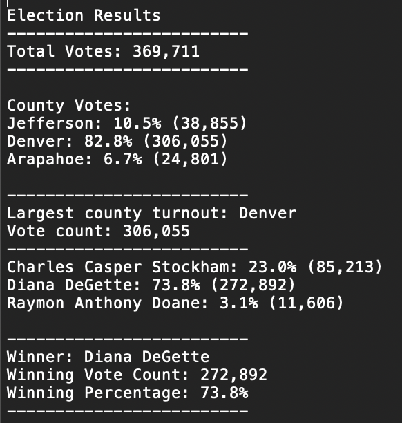
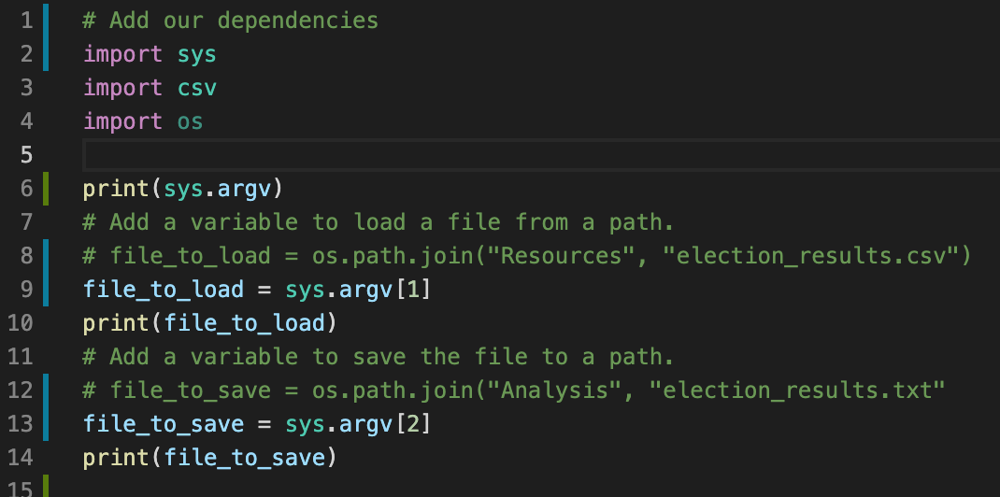
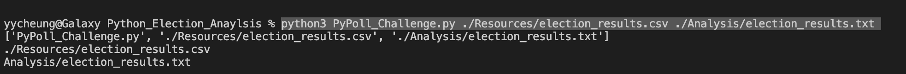

# Election_Anaylsis

## Project Overview
The election commission has requested us to complete the election audit of a recent local congressional election. The following election outcomes are going to be addressed. 

1. Calculate the total number of votes cast.
2. Get a complete list of candidates who received votes.
3. Calculate the total number of votes each candidate received.
4. Calculate the percentage of votes each candidate won.
5. Determine the winner of the election based on popular vote.
6. The voter turnout for each county
7. The percentage of votes from each county out of the total count
8. The county with the highest turnout

## Resources
- Data Source: election_result.csv
- Software: Python 3.6.1, Visual Studio Code 1.38.1

## Election-Audit Results
The analysis of the election show that:

a) There were 369,711 votes cast in the election

b) The county votes summary is:

* Jefferson: 10.5% (38,855 votes cast)

* Denver: 82.8% (306,055 votes cast)

* Arapahoe: 6.7% (24,801 votes cast)

c) Denver had the largest number of votes

d) The candidates were:

* Charles Casper Stockham

* Diana DeGette

* Raymon Anthony Doane

e) The candidate results were:

* Charles Casper Stockham received 23.0% of the vote and 85,213 number of votes

* Diana DeGette received 73.8% of the vote and 272,892 number of votes

* Raymon Anthony Doane received 3.1% of the vote and 11,606 number of votes

f) The winner of the election was Diana DeGette, who received 73.8% of the vote and 272,892 number of votes

    
## Election-Audit Summary

To make this script be applicable to any election, instead of changing the path of file to load manually, we can import a python built in function "sys", and amend the file_to_load path to a changable variable which is controlled by the the user input. Then, the user can just input the file name in the terminal. Same as the file to save path. Demo is shown in the following two screen shots. file_to_load = sys.argv[1], argv[0] is this script, argv[1] is the file to load input by the user, and argv[2] is the file to save input by the user.

In addition to the above, the election might be a state election instead of county, so we can modify the output statement with the word "county" to a variable read from the header, to determine to output "county" or "state".